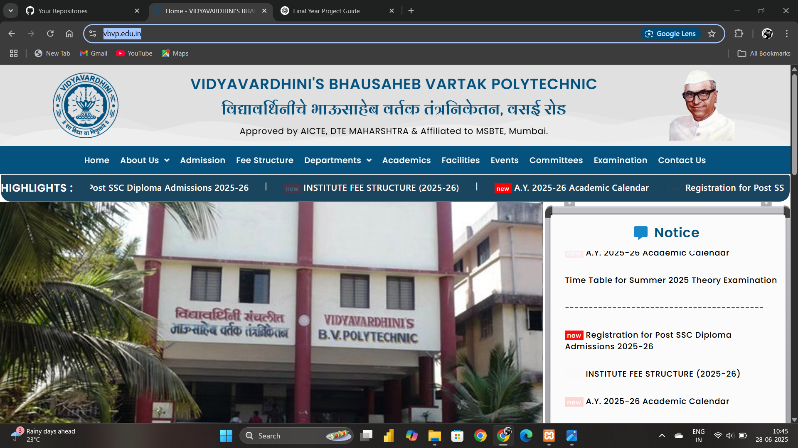
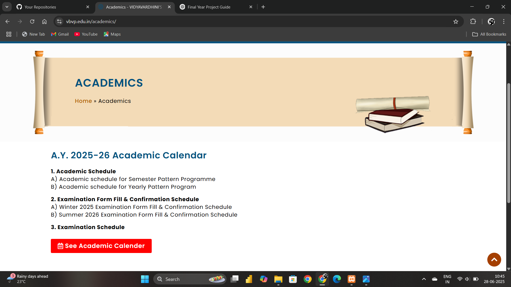
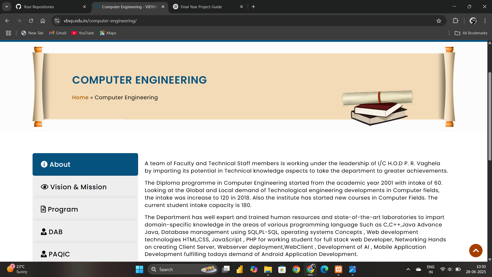
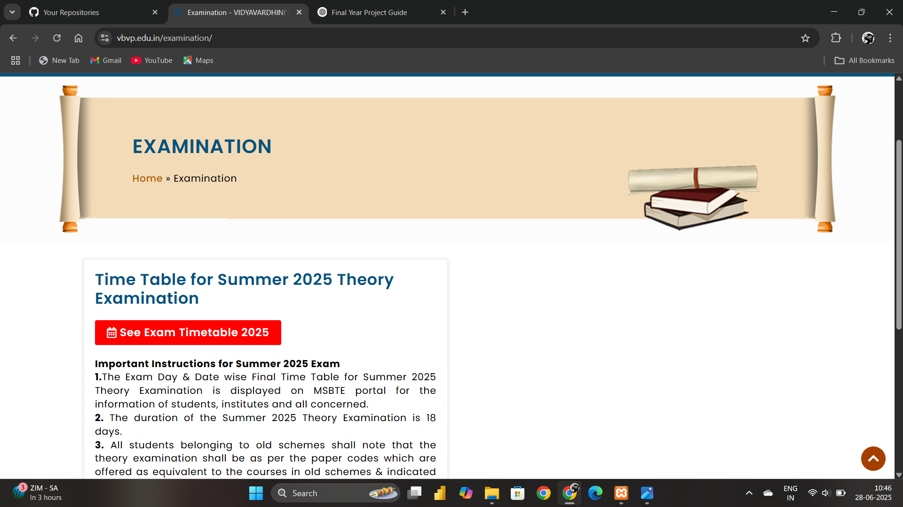
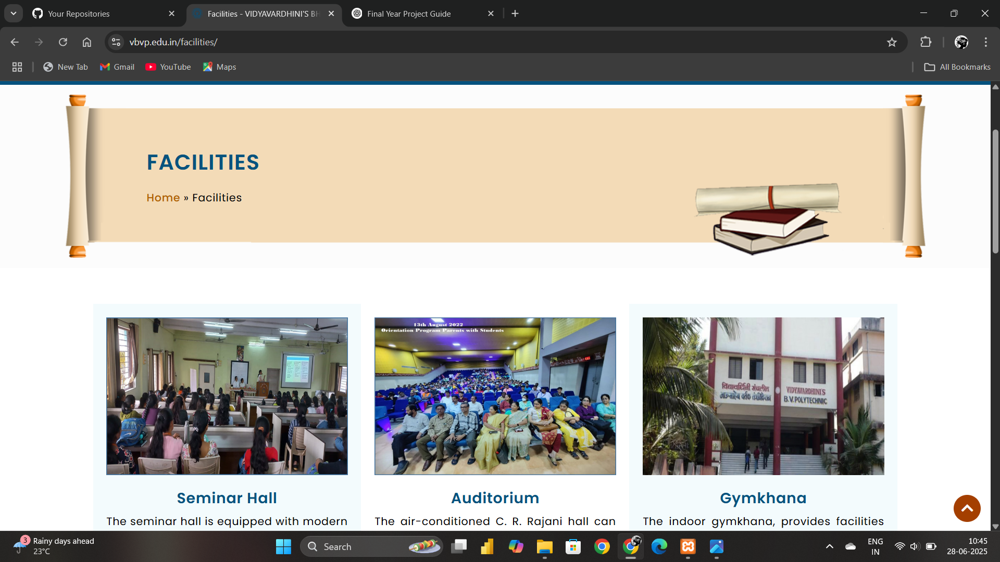
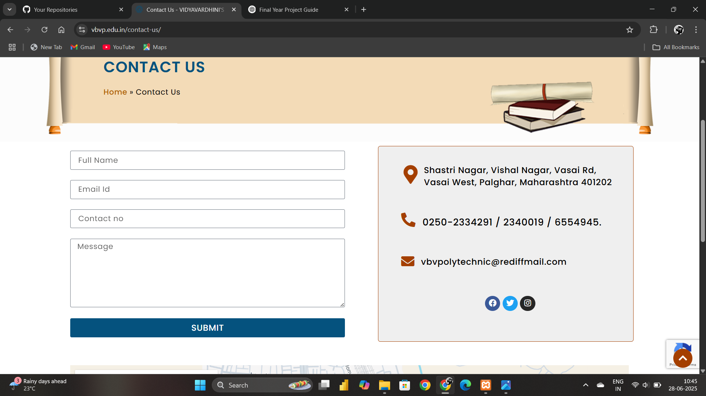

# 🎓 Vidyavardhini's Bhausaheb Vartak Polytechnic Website

This is an informational college website developed as a final year diploma project. The website is designed to provide essential academic and administrative information for students, faculty, and visitors in a structured and user-friendly way.

## 🌐 Live Website
[Visit Now](https://vbvp.edu.in/)

## 📌 Project Overview
The website includes:
- College overview and objectives
- Department-wise details
- Admission information and academic calendar
- News, events, and announcements
- Contact page with inquiry form

## 🛠️ Technologies Used
- **HTML5** – for structuring web pages  
- **CSS3** – for styling and layout  
- **JavaScript** – for interactivity and dynamic features  
- **Bootstrap** – for responsive design  
- **PHP** – for handling form submissions and basic backend tasks

## 👩‍💻 My Role in the Project
- Designed responsive page layouts using HTML, CSS, and Bootstrap  
- Integrated navigation and interactive components with JavaScript  
- Developed and tested forms using PHP  
- Helped structure departmental and academic content

## 🖼️ Screenshots

| Homepage | Academics | Department |
|---------|-----------|------------|
|  |  |  |

| Examination | Facilities | Contact Us |
|-------------|------------|------------|
|  |  |  |

## 📃 Submitted As
- **Final Year Diploma Project**
- **Course**: Computer Engineering  
- **College**: Vidyavardhini's Bhausaheb Vartak Polytechnic  
- **Academic Year**: 2021–2022 

---

> 📢 _Note: This repository does not contain the actual codebase. It is created to document and showcase the final year academic project._
